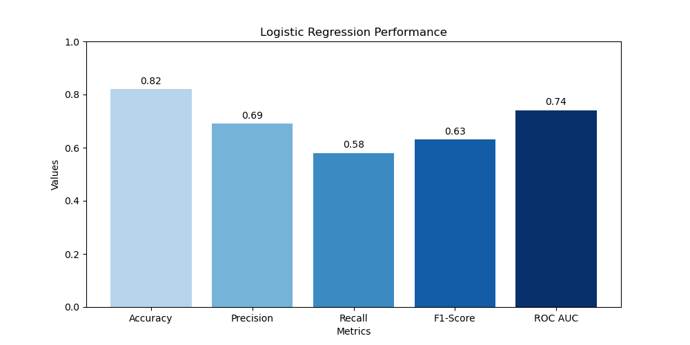

# Logistic Regression Model Card

## Model Details
- **Developer**: Raha AlAssaf
- **Model Date**: June 2, 2024
- **Model Version**: 1.0
- **Model Type**: Logistic Regression
- **Model Framework**: scikit-learn

## Model Description
This Logistic Regression model is developed to predict customer churn in a telecommunications setting. It aims to identify customers at risk of leaving, enabling targeted interventions to improve customer retention.

**Input:** 
Inputs to the Logistic Regression model include customer demographics, account status, service usage, and billing information, all of which are numerically encoded or categorized for model ingestion.

**Output:** 
The output is a binary indicator (0 or 1) where 1 indicates a prediction that the customer will churn and 0 indicates the customer will remain.

**Model Architecture:** 
The model utilizes a logistic regression framework from scikit-learn, designed to model binary outcomes with a logistic function, estimating probabilities that can be thresholded at 0.5 for classification.

## Intended Use
- **Primary Use**: To predict which customers are likely to churn from a telecom provider's services.
- **Users**: Intended for use by customer relationship managers and data science teams within telecommunications companies.

## Training Data
- **Source**: The model was trained using the Telco Customer Churn dataset available on Kaggle.
- **Type**: Includes customer demographics, account information, service usage, and churn labels.
- **Preprocessing**: Data preprocessing included encoding categorical variables, normalizing numerical inputs, and handling missing values.

## Evaluation Data
- **Source**: The same dataset was split into training and testing sets, with an 80/20 split.
- **Preprocessing**: Similar preprocessing as training data to ensure consistency.

## Performance
The Logistic Regression model's performance is quantified through various metrics calculated on a test dataset after training:
- Accuracy: 82%
- Precision: 69%
- Recall: 58%
- F1-Score: 63%
- AUC-ROC: 74%

## Limitations
- Logistic Regression assumes a linear relationship between the independent variables and the log-odds of the dependent variable, which might not hold in complex scenarios like customer behavior patterns.
- The model's performance can degrade if confronted with highly non-linear data without adequate feature engineering.

## Trade-offs
- While Logistic Regression is computationally efficient and interpretable, it might not capture complex patterns as effectively as more sophisticated models like Random Forests or Neural Networks.
- The simplicity of the model allows for quick iterations and is useful for baseline modeling, but it may require more feature engineering to match the performance of other algorithms in non-linear contexts.

## Ethical Considerations
- **Bias and fairness**: Care has been taken to ensure that the model does not exhibit unfair bias towards any particular group of customers. Performance metrics are monitored across different segments to ensure equitable treatment.

## Caveats and Recommendations
- **Model Limitations**: Given the logistic regression’s limitations in handling non-linear relationships, it's advisable to explore more complex models if improvements in predictions are required.
- **Usage Recommendations**: Ideal for use as a preliminary model to identify at-risk customers before applying more complex algorithms for deeper insights.
